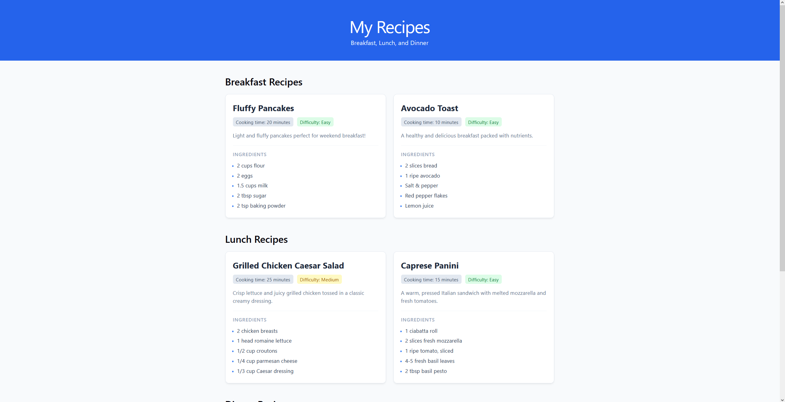

# Recipe Collection App

React app that displays a collection of recipes grouped by meal: Breakfast, Lunch, and Dinner. Each recipe card shows the cooking time, difficulty, ingredients, and a short description.

Built for the take-home assignment **Foundations of Component-Based UI Development with React**.

## Features

- **Header** with the app title and subtitle
- **Three category sections** (Breakfast, Lunch, Dinner), each with two recipes
- **Recipe cards** showing name, cooking time, difficulty, ingredient list, and description
- **Responsive grid:** cards wrap onto new rows as the screen gets narrower
- **Footer** with the author's name and the current year, calculated automatically
